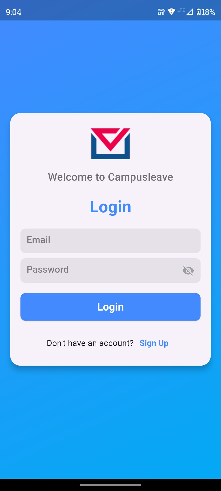
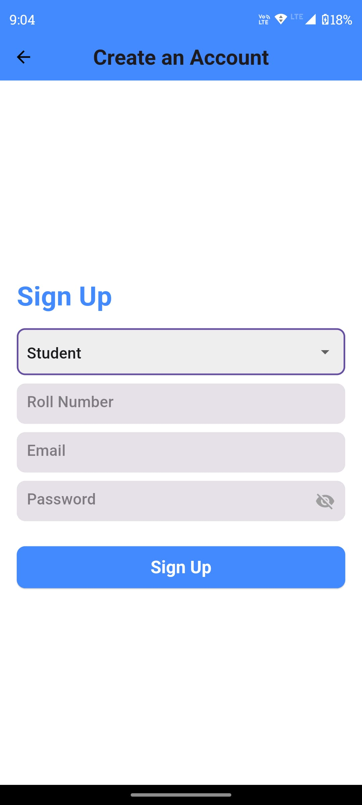
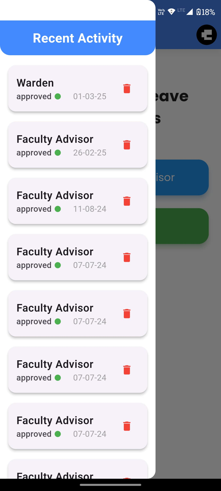
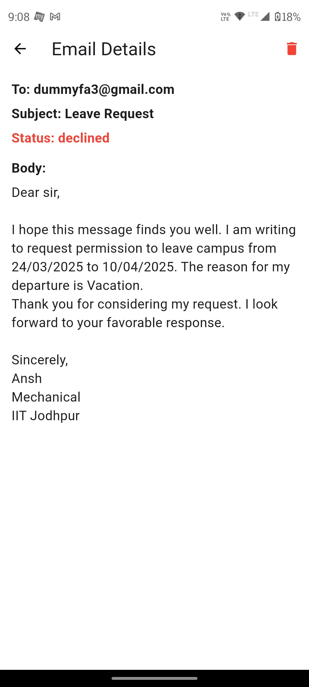
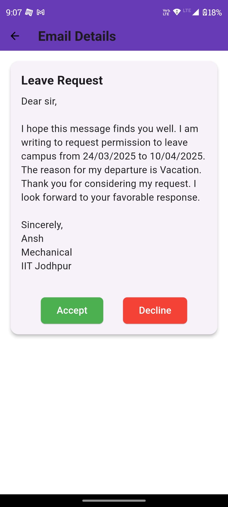
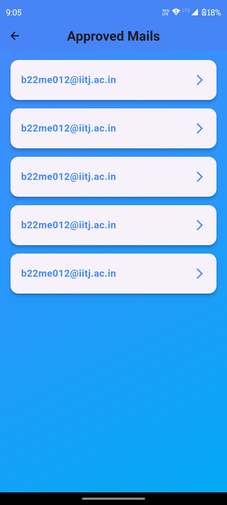
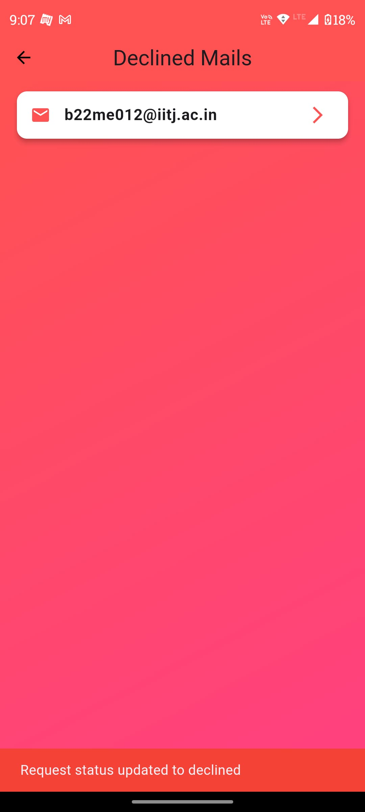
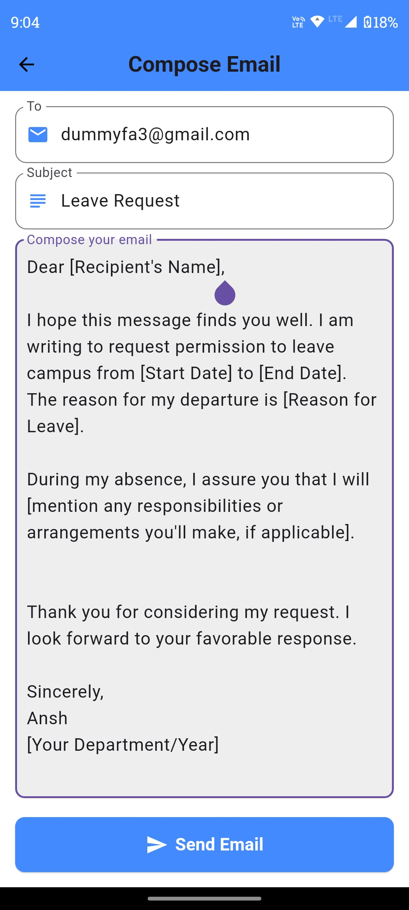

# CampusLeave

CampusLeave is a **Flutter-based** leave approval application designed for students faculty advisor and warden. The app streamlines the leave request process by allowing students to send requests via email, while faculty can approve or decline them with a single click.

## 📌 Features

### **For Students:**

- **User Authentication**: Sign in using registered student data.
- **Leave Request Submission**: Send leave requests to the faculty advisor and warden via email.
- **Recent Activity Drawer**: View sent emails categorized under faculty and warden.
- **Email Details Page**: See details of sent requests.

### **For Faculty and Warden:**

- **View Requests**: A dedicated home screen to see all received requests.
- **Accept/Decline Requests**: Faculty and warden can approve or reject requests directly from the email details page.
- **Accepted & Declined Emails Page**: View categorized leave requests.

## 🖥️ Tech Stack

- **Flutter** - Cross-platform app development
- **Firebase Authentication** - User login system
- **EmailJS** - For handling email requests
- **Provider (Riverpod)** - State management

---

## 📸 Screenshots

<p align="center">
  
  
  
</p>

<p align="center">
  
  
  
</p>

<p align="center">
  
  
  
</p>

<p align="center">
  
</p>

---

## 🚀 How to Run the App

### **1. Clone the Repository**

```sh
git clone https://github.com/Anshhb/CampusLeave.git
cd CampusLeave
```

### **2. Install Dependencies**

```sh
flutter pub get
```

### **3. Run the Application**

```sh
flutter run
```

### **4. Build APK (Optional)**

To generate an APK:

```sh
flutter build apk --release
```

---

## 📬 Contact

For any issues or contributions, feel free to raise an issue or create a pull request.

🔗 **GitHub Repository:** [CampusLeave](https://github.com/Anshhb/CampusLeave)
